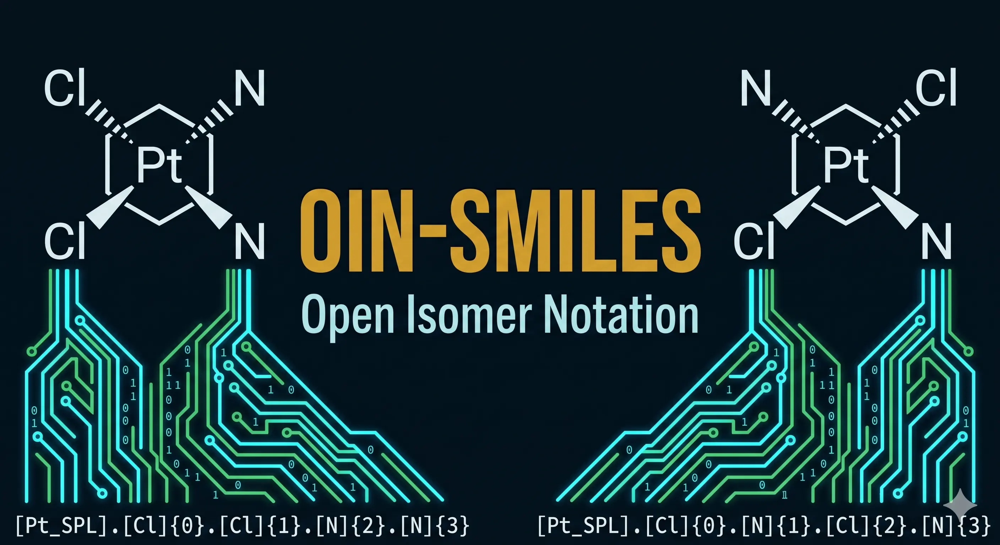

<div align="center">
    
    <h1>OIN-SMILES</h1>
    <h3><em>Canonical, lossless XYZ ↔ SMILES conversion for Transition Metal Complexes.</em></h3>
</div>

<p align="center">
    <strong>An open-source Python library implementing Open Isomer Notation (OIN) — a canonical 1D string format that captures coordination geometry, slot assignments, hapticity, winding direction, and P/N stereochemistry for perfect 3D reconstruction.</strong>
</p>

<p align="center">
    <a href="https://github.com/tjmustard/OIN-SMILES/releases/tag/v0.4.0"></a>
    <a href="https://github.com/tjmustard/OIN-SMILES/actions/workflows/ci.yml"></a>
    <a href="https://github.com/tjmustard/OIN-SMILES/stargazers"></a>
    <a href="https://github.com/tjmustard/OIN-SMILES/blob/main/LICENSE"></a>
</p>

---

## Table of Contents

- [🔬 What is OIN-SMILES?](#-what-is-oin-smiles)
- [🗂️ Canonical Form & Use Cases](#️-canonical-form--use-cases)
- [✨ Features](#-features)
- [⚡ Installation](#-installation)
- [🚀 Usage](#-usage)
- [✅ Verified Examples](#-verified-examples)
- [🛠️ Development](#️-development)
- [🙏 Acknowledgements](#-acknowledgements)
- [📄 License](#-license)

## 🔬 What is OIN-SMILES?

Standard SMILES notation is lossy for transition metal complexes (TMCs): coordination geometry, isomer identity, and P/N stereochemistry are destroyed when you convert a 3D XYZ structure to a 1D string. This breaks any workflow that requires exact isomer preservation — database curation, ML training sets, round-trip structure exchange.

**OIN-SMILES** solves this by implementing **Open Isomer Notation (OIN)** — an extended SMILES format that encodes everything needed to reconstruct the original 3D geometry from the string alone. A cisplatin complex becomes `[Pt_SPL].[Cl]{0}.[Cl]{1}.N{2}.N{3}`; that string unambiguously reconstructs the *cis* square planar geometry, not the *trans* isomer.

## 🗂️ Canonical Form & Use Cases

Beyond round-tripping, OIN aims to be a **canonical** representation: the same complex normalizes to the same string, independent of how the input XYZ was rotated, translated, or (for most complexes) atom-ordered. The encoder gets there by:

- **Normalizing orientation** — the structure is aligned to its principal axes of inertia, so rotated/translated copies of the same geometry collapse to one form.
- **Canonicalizing ligand fragments** — each fragment is emitted as RDKit-canonical SMILES (with binding-atom `c`↔`[cH]` drift fixed), and fragments are ordered by chemical identity rather than input order.
- **Canonicalizing haptic (η) ligands by content** — same-mass rings are keyed on a heading-independent canonical ring SMILES, and the marker atom is the lowest-ranked `CanonicalRankAtoms` (see `CHANGELOG` `[0.3.0]`).
- **Canonicalizing symmetric-donor binding slots** — when a monodentate ligand can bind through either of two resonance-equivalent atoms (e.g. a carboxylate's two oxygens), the `{slot}` marker is placed on a canonically-chosen atom, so structures that differ only in which Kekulé atom 3D bond perception picked collapse to one string (see `CHANGELOG` `[0.3.5]`).

> [!NOTE]
> Canonicalization is exact for the common cases — normalized up to orientation and fragment identity. A few highly symmetric coordination spheres (symmetric slot numbering, symmetric η-ring winding labels, metal `@SP/@OH` descriptors) may still need light normalization before an exact string comparison; the round-trip verifier applies that normalization. Treat the format as canonical **within a format version**.

**Why this matters:**

- **Deduplication** — because each isomer maps to one canonical string, exact-match deduplication across a TMC dataset is a plain string comparison: no 3D alignment, no graph isomorphism.
- **Isomer-aware similarity search** — OIN is the substrate that keeps *cis*/*trans*, *fac*/*mer*, and P/N stereoisomers distinct. Plain SMILES fingerprints collapse exactly the coordination isomers that matter for TMCs; building fingerprints or keys on top of OIN preserves those distinctions so similarity comparisons aren't fooled.

## ✨ Features

- **Lossless Round-Tripping**: XYZ → OIN → XYZ → OIN with exact isomer preservation.
- **Canonical Form**: The same complex normalizes to one string — enabling exact-match deduplication and isomer-aware similarity search across TMC datasets. Symmetric-donor binding slots (e.g. a carboxylate's two equivalent oxygens) are canonicalized so resonance-equivalent structures encode identically. See [Canonical Form & Use Cases](#️-canonical-form--use-cases).
- **Open Isomer Notation (OIN) v3.7**: Compact inline format encoding coordination geometry, slot assignments, hapticity, winding direction, and P/N stereochemistry. The metal token is descriptor-free (`[Pt_SPL]`); cis/trans and fac/mer isomerism is carried entirely by slot order. Parsers still accept legacy `@desc` tokens.
- **Robust Graph Generation**: Powered by the Jensen Group's `xyz2mol` algorithm for TMCs.
- **3D Generation**: The vendored **MetalloGen** engine (dummy-metal + RDKit `CoordMap` embed, constrained MMFF/UFF cleanup, standard `g-xTB` refinement with optional MACE accuracy enhancement; uses coordination-geometry-matched conformer selection). Coordination numbers up to 8 are supported (including square-antiprismatic, `SQA`), and tricky donors — NHC carbenes, dative amines, and quinoid (amidinate / 2-iminopyridine) ligands — keep their correct hydrogen count and generate without kekulization crashes. Special handling for aromatic η-ligands (Cp, indenyl) via ETKDG embedding with de-aromatization to avoid RDKit kekulization failures. Terminal anionic donors (silylamide, anilide, phosphinimide, terminal nitride) and non-binding anionic chalcogen donors (croconate / oxo ring O, nitrito –O) keep their exact hydrogen count and formal charge, and a terminal nitride (`[N]{n}`) is distinguished from an ammine (`N{n}`) in the notation (see CHANGELOG `[0.3.7]`).
- **P/S/Si Stereocenter Encoding & Enforcement**: metal-bound chiral phosphorus centers are encoded as `[P@]`/`[P@@]` from the 3D structure and generate the correct enantiomer on both tetrahedral and square-planar complexes. A Zone-A P donor — one that binds the metal directly through a stereogenic lone pair — recovers its handedness across the full OIN → 3D → OIN round trip, and backbone (non-metal-bound) P, S, and Si stereocentres are carried through generation and re-oriented to the encoded handedness. (Nitrogen stereocenters are carried on backbone atoms; direct `[N@]` encoding is deferred — see CHANGELOG.)
- **Double-Bond (E/Z) Stereo**: C=C cis/trans geometry is captured in the OIN string (`/`, `\`) and reproduced deterministically through 3D generation, so an *E* alkene never regenerates as *Z*. Applies to geometrically free double bonds; those locked by chelation are left to the coordination sphere.
- **sp3 Atom Stereochemistry (`@`/`@@`)**: tetrahedral atom stereocentres on the ligand backbone — carbon, and heteroatoms such as sulfur and silicon — are encoded as `[C@H]`/`[C@@H]` and round-trip through 3D generation, including centres adjacent to the metal or an η-ligand (whose CIP label is resolved against the metal-free fragment). Stereo the OIN leaves unspecified is not invented on regeneration. See CHANGELOG `[0.3.7]`.
- **Haptic-Face Round-Tripping**: η-ligand winding markers (`{n>}`/`{n<}`) survive the round trip and control which ring face the metal binds during 3D generation. Bond orders on metal-bound haptic ligands — e.g. the internal double bond of an η³-allyl — are preserved by template transfer rather than flattened to all-single on regeneration.
- **Deterministic, faster 3D generation**: generation is seeded (default `seed=42`), so the same OIN produces byte-identical XYZ across runs; pass `--seed`/`OIN3DGenerator(seed=…)` to sample a different reproducible conformer. The v0.4.0 performance wave made 1D → 3D generation markedly faster without changing the generated chemistry — roughly **12× for small complexes** (cisplatin) and **~5–7× for larger ones** (ferrocene, fac-Ir(ppy)₃), by memoizing the bond-order solver and removing redundant ETKDG embedding work. See CHANGELOG `[0.4.0]`.
- **CLI**: `oin-smiles` command for one-line conversions.

## ⚡ Installation

This project uses [`uv`](https://docs.astral.sh/uv/) for dependency management. The
default install is lightweight — the fast FF + g-xTB path, with **no `torch`**. The
machine-learning (MACE) optimizer is an opt-in extra.

1. **Install `uv`** (if not already installed):

    ```bash
    curl -LsSf https://astral.sh/uv/install.sh | sh
    ```

2. **Clone the repository:**

    ```bash
    git clone https://github.com/tjmustard/OIN-SMILES.git
    cd OIN-SMILES
    ```

3. **Install dependencies:**

    ```bash
    uv sync
    ```

4. **Install `g-xTB`** (recommended — the default 3D-generation optimizer):

    OIN-SMILES defaults to Grimme Lab's `g-xTB` for fast, accurate structural refinement.
    ```bash
    bash tools/install_gxtb.sh
    ```
    *Detects your OS/architecture (Linux/macOS) and drops the static binary into
    `.venv/bin` to keep your system clean. If `xtb` is absent, 3D generation falls
    back to the force field automatically.*

5. **(Optional) MACE machine-learning optimizer** — highest accuracy:

    ```bash
    uv sync --extra mace                  # pulls mace-torch + a pinned CUDA 11.8 torch
    bash tools/install_mace_weights.sh    # downloads the weights + writes .env
    ```
    See [`docs/OPTIMIZERS.md`](docs/OPTIMIZERS.md) and
    [`models/mace/README.md`](models/mace/README.md) for details.

> [!NOTE]
> The `mace` extra pulls PyTorch with CUDA 11.8 (configured via `tool.uv.index` in
> `pyproject.toml`). For a CPU-only or different-CUDA build, adjust that index URL
> before syncing. The default `uv sync` installs neither `torch` nor `mace-torch`.

## 🚀 Usage

### CLI

```bash
# XYZ → OIN
uv run oin-smiles xyz2oin complex.xyz

# OIN → XYZ (prints XYZ block to stdout).
# Default backend is the MetalloGen engine refined with standard g-xTB.
uv run oin-smiles oin2xyz "[Pt_SPL].[Cl]{0}.[Cl]{1}.N{2}.N{3}"

# Higher accuracy MACE refinement (needs the `mace` extra + weights; note --extra mace):
uv run --extra mace oin-smiles oin2xyz "[Pt_SPL].[Cl]{0}.[Cl]{1}.N{2}.N{3}" --optimizer mace-omol-0-extra-large-1024

# Fast FF-only path (no torch/xtb):
uv run oin-smiles oin2xyz "[Pt_SPL].[Cl]{0}.[Cl]{1}.N{2}.N{3}" --optimizer ff

# Deterministic generation: the same seed always yields the same conformer.
# Change --seed to sample a different (still reproducible) structure. Default is 42.
uv run oin-smiles oin2xyz "[Pt_SPL].[Cl]{0}.[Cl]{1}.N{2}.N{3}" --seed 7
```

### 3D to 1D (XYZ to OIN)

```python
from oinsmiles import XYZToSMILES

oin = XYZToSMILES().convert("complex.xyz")
print(oin)
```

### 1D to 3D (OIN to XYZ)

```python
from oinsmiles.generation.engine import OIN3DGenerator

# 3D generation uses the MetalloGen engine refined with standard g-xTB (requires g-xTB binary).
# Use optimizer="mace-omol-0-extra-large-1024" for higher accuracy MLIP refinement,
# or optimizer="ff" for the fast FF-only path.
generator = OIN3DGenerator()
result = generator.generate("[Pt_SPL].[Cl]{0}.[Cl]{1}.N{2}.N{3}")

# XYZ block (always available)
with open("generated.xyz", "w") as f:
    f.write(result.xyz)

# Bonded RDKit mol — includes M–L dative bonds and full ligand connectivity
# (None if bond connectivity could not be determined, e.g. for eta fallbacks)
if result.mol is not None:
    from rdkit import Chem
    Chem.MolToMolFile(result.mol, "generated.mol")
    writer = Chem.SDWriter("generated.sdf")
    writer.write(result.mol)
    writer.close()
```

### 3D Optimization Workflow

The MetalloGen engine implements a multi-stage optimization pipeline for 1D → 3D generation:

1. **Force Field Relaxation (Default)**: Uses constrained MMFF/UFF to relax the generated conformers into the geometric template. Convergence criteria are controlled by `ff_preset` (`loose`, `default`, `tight`, `very_tight`).

2. **MLIP / Semi-empirical Refinement (Optional)**: Refines the FF-relaxed geometry pool using an advanced optimizer like standard `g-xTB` (default) or MACE (e.g., `mace-omol-0-extra-large-1024`), then energy-ranks the ensemble. The returned conformer is chosen by **coordination-geometry match** to the requested template (e.g. square-planar), with energy breaking ties — so a floppy donor that admits an energetically competitive distorted geometry still yields the correct isomer. Haptic (η) ligands fall back to lowest-energy.

```python
# Generate an ensemble of 5, pre-optimize with tight FF, and refine with MACE
generator = OIN3DGenerator(
    ff_preset="tight",
    optimizer="mace-omol-0-extra-large-1024",
    ensemble_size=5,
    timeout=120
)
```

Generation is bounded by the `timeout` limit (seconds); it stops and returns without a conformer once the limit is reached.

### OIN v3.7 Inline Format

**Cisplatin** (square planar, *cis* isomer):

```text
[Pt_SPL].[Cl]{0}.[Cl]{1}.N{2}.N{3}
```

**Transplatin** (square planar, *trans* isomer):

```text
[Pt_SPL].[Cl]{0}.N{1}.[Cl]{2}.N{3}
```

**Key fields:**

| Element | Meaning |
|---|---|
| `[Pt_SPL]` | Metal atom + geometry template (`SPL` = Square Planar); isomerism (cis/trans, fac/mer) is carried entirely by slot order, not by the metal token |
| `{n}` | Slot tag — assigns the preceding binding atom to slot *n* of the geometry template |
| `{n>}` / `{n<}` | Slot tag with winding direction (CW / CCW) for η-ligands |
| `[P@]` / `[P@@]` | Metal-bound phosphorus stereocenter (lone-pair CIP convention) |
| `.` | Fragment separator (metal + each ligand) |

**Geometry templates:** `LIN`, `TPL`, `TET`, `SPL`, `SPY`, `TBP`, `OCT`, `PBP`, `TPY`


## ✅ Verified Examples

The following complexes pass the full round-trip test (OIN string identity + RMSD < 1.0 Å):

**Square Planar & Simple Geometries**
- **Cisplatin** — square planar Pt
- **Transplatin** — square planar Pt, trans isomer
- **Ferrocene** — metallocene with eclipsed Cp rings
- **VOacac2** — square pyramidal vanadium with bidentate acetylacetonate ligands

**P/N Stereocenter Encoding**
- **PdCl2-R-BINAP** — square planar Pd with axial-chiral BINAP diphosphine (2,2'-bis(diphenylphosphino)-1,1'-binaphthyl)
- **PdCl2-RR-BDNN** — square planar Pd with RR-BDNN N-chiral diphosphine (N,N-bis(diethylamino)naphthalene with chiral centers on nitrogen)
- **PdCl2-RR-BDPP** — square planar Pd with RR-BDPP P-chiral diphosphine (phosphorus stereocenters with proper @/@@ encoding in SMILES)

**Ansa-Metallocenes (Aromatic η-Ligands)**
- **TiCat1** — tetrahedral Ti with bridged Cp–Si(Me)₂–Cp ligand (3D generation fixed; round-trip bonding inference incomplete due to de-aromatization requirement)
- **TiCat3** — tetrahedral Ti with bridged indenyl–Si(Me)₂–indenyl ligand (3D generation fixed)
- **TiCat4** — tetrahedral Ti with bridged indenyl–Si(Me)₂–indenyl ligand variant (3D generation fixed)

**Dataset-scale validation** — beyond these hand-checked fixtures, OIN-SMILES round-trips **≈89%** of the 2,608-complex tmCAT/tmPHOTO benchmark on the default FF path (XYZ → OIN → XYZ → OIN, canonical string identity + coordination-sphere RMSD), up from 85.4% before the v0.3.7 residual-fix wave. See `CHANGELOG.md` `[0.3.7]` for the per-failure-class breakdown.

## 🛠️ Development

### Running Tests

```bash
uv run python -m unittest discover tests
```

### Verification Scripts

Three scripts are available for QA:

```bash
# Fast smoke test (~4 examples, no tmQM dataset)
bash tests/run_verification_fast.sh

# Full suite — all manual examples
bash tests/run_verification.sh

# Comprehensive — all examples including tmQM dataset (~103 complexes)
bash tests/run_verification_ALL.sh
```

Or run individual scripts:

```bash
# XYZ → OIN correctness
uv run python tests/integration/verify_xyz_to_oin.py [--include-tmqm]

# Full round-trip: XYZ → OIN → XYZ → OIN (RMSD + string identity)
# Writes XYZ, MOL, SDF and OIN files to --output-dir when provided
uv run python tests/integration/verify_roundtrip.py [--output-dir /tmp/results] [--optimizer <opt>] [--ff-preset <preset>]

# Process and round-trip a large XYZ dataset
uv run python tools/test_dataset_roundtrip.py --dataset-dir <dir> --output-dir <dir> [--quick] [--continue] [--mol-timeout 60] [--random]

# Recalculate OIN SMILES for an existing dataset run after codebase changes
uv run python tools/recalculate_oin_smiles.py --output-dir <results-dir>
```

All scripts write named output artifacts when `--output-dir` is specified:
- `Ex1_CisPlatinXYZ-OIN-SMILES_original.xyz` / `.mol` / `.sdf` — input structure
- `Ex1_CisPlatinXYZ-OIN-SMILES_generated.xyz` / `.mol` / `.sdf` — generated structure
- `.mol` and `.sdf` files include full bond connectivity for generated structures

> [!NOTE]
> Generated MOL/SDF files use **V3000 format** when dative bonds are present (M–L bonds), which is standard for organometallic structures.

## 🙏 Acknowledgements

- **[MetalloGen](https://github.com/kyunghoonlee777/MetalloGen)** — 3D generation engine and optimization workflows for transition metal complexes.
- **[MACE](https://github.com/acesuit/mace)** — Fast and accurate Machine Learning Interatomic Potentials (MLIP) for 3D geometry refinement.
- **[xyz2mol](https://github.com/jensengroup/xyz2mol_tm)** — Jensen Group's algorithm for robust graph generation from 3D coordinates.
- **[OpenBabel](https://github.com/openbabel/openbabel) & [XTB](https://github.com/grimme-lab/xtb)** — Chemical file handling and semi-empirical geometry optimization.

## 📄 License

This project is licensed under the terms of the MIT open source license. Please refer to the [LICENSE](./LICENSE) file for the full terms.
